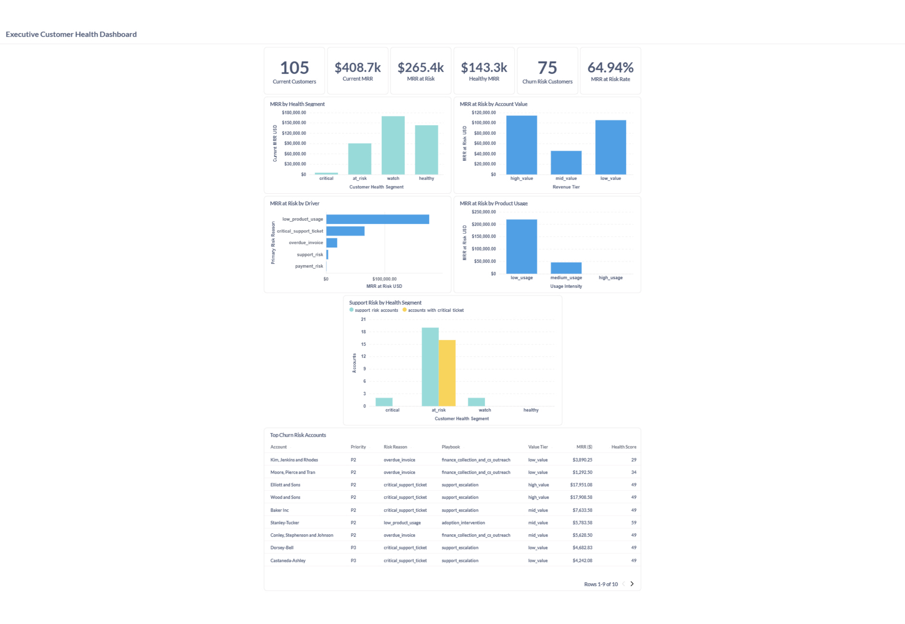
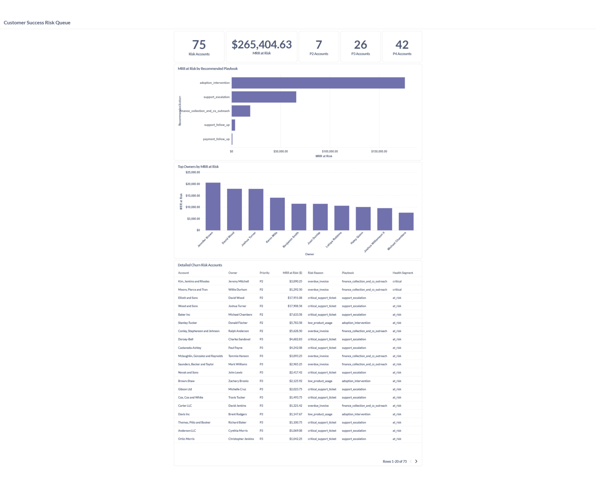

# SaaS Revenue & Customer Health Data Platform

Production-style analytics engineering project for a B2B SaaS business.

This project simulates a modern data platform that integrates CRM, billing, product usage, and support data to build customer health scoring, churn risk prioritization, revenue retention analytics, and executive-ready dashboards.

The goal is to demonstrate how raw operational data can be transformed into reliable business metrics through Python ingestion, PostgreSQL warehouse modeling, dbt transformations, data quality checks, business logic tests, dbt documentation, dashboard exposures, and Metabase reporting.

---

## Business Problem

A B2B SaaS company needs a reliable analytics platform to answer questions such as:

- How much current MRR is active across the customer base?
- Which customers are healthy, at risk, critical, or under watch?
- How much MRR is exposed to churn risk?
- Which accounts should Customer Success prioritize first?
- What are the main churn risk drivers: low product usage, payment issues, support burden, or critical tickets?
- How does product adoption relate to customer health?
- Which account owners manage the highest MRR at risk?
- What should executives monitor weekly?

This project builds a warehouse and BI layer to answer those questions consistently.

---

## Current Status

The project currently includes:

- Synthetic SaaS source data generation
- PostgreSQL warehouse running in Docker
- Raw data loading with Python
- Raw data validation and audit tables
- dbt staging, intermediate, and mart layers
- Business-ready customer health and churn risk models
- dbt schema tests and custom business logic tests
- dbt documentation and dashboard exposures
- Metabase executive and operational dashboards
- Dashboard screenshots for GitHub documentation
- One-command local pipeline runner
- Pipeline and stage-level observability tables
- GitHub Actions CI workflow for automated validation
- Row-count observability across raw, staging, intermediate, and mart layers
- Airflow DAG for production-style orchestration

Future production improvements include full Airflow runtime support, alerting, freshness checks, SQL linting, and pre-commit automation.

---

## Tech Stack

Implemented:

- Python
- PostgreSQL 16
- dbt
- Docker Compose
- Metabase
- PowerShell
- Git / GitHub
- GitHub Actions

Implemented production-readiness features:

- One-command local pipeline runner
- Pipeline and stage-level observability tables
- GitHub Actions CI workflow for automated pipeline validation
- Pinned Python and dbt dependencies for reproducible builds
- Python linting and formatting checks with Ruff

Planned / next production-readiness improvements:

- Full local Airflow Docker runtime
- Data freshness observability
- SQL linting with SQLFluff
- pre-commit hooks
- Alerting thresholds

---

## Architecture

```text
Synthetic SaaS Sources
        ↓
Python Data Generation
        ↓
CSV Source Files
        ↓
Python Raw Loader
        ↓
PostgreSQL Raw Schema
        ↓
Raw Validation & Load Audit
        ↓
dbt Staging Models
        ↓
dbt Intermediate Models
        ↓
dbt Business Marts
        ↓
dbt Tests + Business Logic Tests
        ↓
dbt Docs + Exposures
        ↓
Metabase Dashboards
```

## Data Sources

The platform uses synthetic data representing four operational systems:

### CRM

- Accounts
- Contacts
- Deals

### Billing

- Customers
- Subscriptions
- Invoices
- Payments

### Product

- Product events
- Active users
- Feature adoption
- Integration and report creation activity

### Support

- Tickets
- Ticket status
- Ticket priority
- Resolution signals
- Support burden indicators

---

## Warehouse Layers

The warehouse follows a layered analytics engineering design.

### Raw Layer

Source-aligned tables loaded into PostgreSQL.

Examples:

- `raw.crm_accounts`
- `raw.crm_contacts`
- `raw.crm_deals`
- `raw.billing_customers`
- `raw.billing_subscriptions`
- `raw.billing_invoices`
- `raw.billing_payments`
- `raw.product_events`
- `raw.support_tickets`

### Staging Layer

Typed, cleaned, and standardized source models.

Examples:

- `staging.stg_crm__accounts`
- `staging.stg_billing__subscriptions`
- `staging.stg_product__events`
- `staging.stg_support__tickets`

### Intermediate Layer

Business logic, account-level aggregations, customer health signals, revenue summaries, product usage summaries, and support summaries.

Examples:

- `intermediate.int_customer__account_base`
- `intermediate.int_customer__health_signals`
- `intermediate.int_revenue__subscriptions_enriched`
- `intermediate.int_revenue__invoice_payment_summary`
- `intermediate.int_product__account_usage`
- `intermediate.int_support__account_ticket_summary`

### Mart Layer

BI-ready models for executive reporting and operational decision-making.

Current marts:

- `marts.mart_customer_health`
- `marts.mart_account_360`
- `marts.mart_revenue_retention`
- `marts.mart_churn_risk`
- `marts.mart_product_adoption`
- `marts.mart_support_operations`

---

## Key Business Marts

### `mart_account_360`

Main account-level mart with one row per account.

Includes:

- Lifecycle status
- Current MRR
- MRR at risk
- Customer health segment
- Health score
- Revenue tier
- Product usage
- Support burden
- Recommended account action

### `mart_customer_health`

Customer health mart for executive reporting and Customer Success prioritization.

Includes:

- Raw customer health score
- Adjusted customer health score
- Customer health segment
- Churn risk flag
- Revenue, product, support, payment, and relationship signals

### `mart_revenue_retention`

Revenue retention summary by health segment, revenue tier, and account priority action.

Includes:

- Current MRR
- Healthy MRR
- Non-healthy MRR
- MRR at risk
- Customer risk rate
- MRR at risk rate

### `mart_churn_risk`

Operational churn risk queue.

Includes:

- Account-level risk priority
- MRR at risk
- Primary risk reason
- Recommended risk playbook
- Support, payment, and usage risk signals

### `mart_product_adoption`

Product usage and adoption summary.

Includes:

- Usage intensity
- Feature adoption
- Active users
- Active days
- Integration adoption
- Report creation
- Low-usage paid account rate

### `mart_support_operations`

Support operations mart.

Includes:

- Support burden level
- Open tickets
- High-priority tickets
- Critical tickets
- Support risk accounts
- Support risk account rate

---

## Data Quality & Business Logic Tests

The project includes dbt schema tests and custom business logic tests.

Validation coverage includes:

- Primary key checks
- Not-null checks
- Accepted values
- Relationship checks
- Raw data validation
- Business rule assertions

Examples of business logic tests:

- Healthy customers must not be marked as churn risk.
- Non-customers must have zero current MRR.
- Accounts without churn risk must have zero MRR at risk.
- The churn risk mart must only contain accounts marked as risk accounts.
- Revenue retention totals must match account-level totals.

These tests help ensure that the marts are not only technically valid, but also business-consistent.

Additional data contract tests validate:

- Customer health scores remain between 0 and 100.
- Financial metrics such as current MRR, healthy MRR, non-healthy MRR, and MRR at risk are non-negative.
- Account-level MRR components reconcile correctly.
- Revenue retention, product adoption, and support operation rates remain between 0 and 1.
- Churn risk priority ranks remain within valid operational priority bands.

---

## dbt Documentation & Exposures

The project includes dbt documentation for the mart layer and dbt exposures for the dashboard layer.

Current dashboard exposures:

- Executive Customer Health Dashboard
- Customer Success Risk Queue
- Product Adoption and Retention Dashboard
- Support Operations Dashboard

These exposures document the relationship between BI assets and the dbt models that power them.

---

## Dashboards

The project includes two Metabase dashboards.

### Executive Customer Health Dashboard

Executive dashboard focused on SaaS customer health, MRR exposure, revenue risk, and churn drivers.

It includes:

- Current customers
- Current MRR
- MRR at risk
- Healthy MRR
- Churn risk customers
- MRR at risk rate
- MRR by health segment
- MRR at risk by account value
- MRR at risk by driver
- MRR at risk by product usage
- Support risk by health segment
- Top churn risk accounts



### Customer Success Risk Queue

Operational dashboard for Customer Success teams to prioritize account intervention.

It includes:

- Risk accounts
- MRR at risk
- P2, P3, and P4 risk account counts
- MRR at risk by recommended playbook
- Top owners by MRR at risk
- Detailed churn risk account queue



---

## Key Insights from the Current Synthetic Dataset

The generated dataset shows:

- 105 current customers.
- Approximately `$408.7K` in current MRR.
- Approximately `$265.4K` in MRR at risk.
- 75 current customers classified as churn risk.
- Low product usage is the largest churn risk driver by MRR exposure.
- High-value and mid-value accounts still represent meaningful MRR at risk.
- Support risk is concentrated primarily in at-risk and critical customer segments.
- Healthy customers can have normal support activity, but no critical support-driven churn risk.

---

## How to Run Locally

### 1. Clone the repository

```bash
git clone https://github.com/rirts/saas-revenue-customer-health-platform.git
cd saas-revenue-customer-health-platform
```

### 2. Create and activate a Python virtual environment

Windows PowerShell:

```powershell
python -m venv .venv
.\.venv\Scripts\Activate.ps1
```

### 3. Install Python dependencies

```powershell
pip install -r requirements.txt
```

### 4. Start Docker services

```powershell
docker compose up -d
```

Expected services:

- PostgreSQL on port `5432`
- Metabase on port `3001`

### 5. Generate synthetic data

```powershell
python scripts\generate_synthetic_data.py
```

### 6. Load raw data into PostgreSQL

```powershell
python scripts\load_raw_to_postgres.py
```

### 7. Validate raw data

```powershell
python scripts\validate_raw_data.py
```

### 8. Install dbt dependencies

```powershell
dbt deps --project-dir warehouse\dbt --profiles-dir warehouse\dbt
```

### 9. Run dbt build

```powershell
dbt build --project-dir warehouse\dbt --profiles-dir warehouse\dbt
```

### 10. Generate dbt docs

```powershell
dbt docs generate --project-dir warehouse\dbt --profiles-dir warehouse\dbt
```

### 11. Serve dbt docs locally

```powershell
dbt docs serve --project-dir warehouse\dbt --profiles-dir warehouse\dbt
```

### 12. Open Metabase

Open:

```text
http://localhost:3001
```

Use Metabase to inspect the dashboards and marts.

---

## Operations Runbook

For operational guidance, troubleshooting steps, monitoring queries, and validation procedures, see:

- [`OPERATIONS_RUNBOOK.md`](OPERATIONS_RUNBOOK.md): operational guide for running, validating, monitoring, and troubleshooting the platform.

---

## Useful Validation Queries

### Account 360 row count

```sql
select count(*)
from marts.mart_account_360;
```

Expected result:

```text
250
```

### Current customer MRR summary

```sql
select
    count(*) filter (where is_current_customer) as current_customers,
    round(sum(current_mrr_usd) filter (where is_current_customer), 2) as current_mrr_usd,
    round(sum(mrr_at_risk_usd) filter (where is_current_customer), 2) as mrr_at_risk_usd,
    count(*) filter (
        where is_current_customer
          and is_churn_risk
    ) as churn_risk_customers
from marts.mart_account_360;
```

---

## Project Structure

```text
saas-revenue-customer-health-platform/
├── .github/
│   └── workflows/
│       └── ci.yml
├── data/
│   ├── raw/
│   └── synthetic/
├── orchestration/
│   └── airflow/
│       ├── dags/
│       │   └── saas_platform_pipeline.py
│       ├── logs/
│       └── plugins/
├── reports/
│   └── screenshots/
├── scripts/
│   ├── collect_table_row_counts.py
│   ├── convert_dashboard_pdfs_to_png.py
│   ├── create_monitoring_tables.sql
│   ├── generate_synthetic_data.py
│   ├── load_raw_to_postgres.py
│   ├── run_pipeline.ps1
│   └── validate_raw_data.py
├── warehouse/
│   └── dbt/
│       ├── models/
│       │   ├── staging/
│       │   ├── intermediate/
│       │   └── marts/
│       ├── macros/
│       ├── tests/
│       ├── dbt_project.yml
│       ├── packages.yml
│       └── profiles.yml
├── docker-compose.yml
├── pyproject.toml
├── requirements.txt
├── README.md
├── OPERATIONS_RUNBOOK.md
└── .gitignore

```

---

## Production Readiness Roadmap

The project already includes a strong analytics engineering foundation. The next improvements required to make it more production-grade are:

### 1. One-command pipeline execution

Implemented with:

```powershell
.\scripts\run_pipeline.ps1
```

The script executes the pipeline end-to-end and records run-level and stage-level audit metadata.

### 2. CI/CD

Implemented with GitHub Actions.

The CI workflow runs on pushes and pull requests to `main` and validates:

- Python dependency installation
- PostgreSQL service startup
- Synthetic data generation
- Raw data loading
- Raw data validation
- dbt dependency installation
- dbt build

This ensures the analytics pipeline is automatically tested outside the local development environment.

### 3. Orchestration

Implemented as an Airflow DAG under:

```text
orchestration/airflow/dags/saas_platform_pipeline.py
```

The DAG orchestrates:
- Synthetic data generation
- Raw data loading
- Raw data validation
- dbt dependency installation
- dbt build
- Warehouse row-count collection

Planned improvements:

- Full local Airflow Docker runtime
- Airflow metadata database setup
- Airflow UI documentation
- Alerting on failed DAG runs

### 4. Observability

Implemented:

- Pipeline-level audit table: `monitoring.pipeline_run_audit`
- Stage-level audit table: `monitoring.pipeline_stage_audit`
- Raw ingestion audit table: `monitoring.raw_load_audit`
- Warehouse row-count audit table: `monitoring.table_row_count_audit`
- Run-level status tracking
- Stage-level status tracking
- Stage duration tracking
- Error message capture for failed stages
- Row-count snapshots for raw, staging, intermediate, and mart relations

Planned improvements:

- dbt model execution metrics
- Data freshness checks
- Alerting thresholds

### 5. Linting and code quality

Implemented:

- Ruff lint checks for Python scripts and Airflow DAGs
- Ruff format checks for Python scripts and Airflow DAGs
- Ruff validation in GitHub Actions CI

Planned improvements:

- SQLFluff for dbt SQL linting
- pre-commit hooks for local automated checks

---

## License

All rights reserved.

No permission is granted to use, copy, modify, or distribute this work without explicit written consent from the copyright holder.